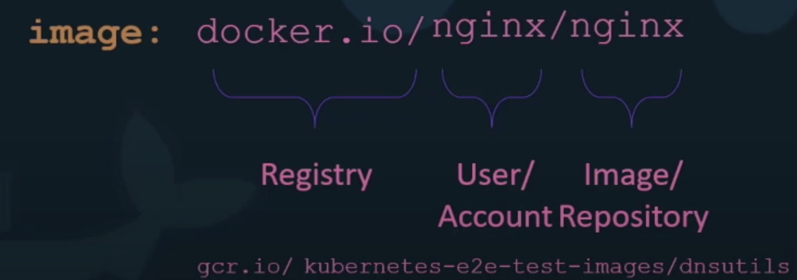

- Image
    - image: nginx/nginx  
    - the first part stands for the user or account(docker hub account) name
    - the second part repository
- Deploy Private Registry
    - registry is another application and is available as a docker image 
    - exposes the API on port 5000 