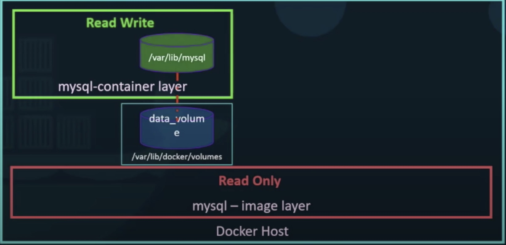

- File system
    - /var/lib/docker
         - storage driver
            - selection driver based on the underlying OS
            - response
                - maintaining the layered architecture
                - creating a writable layer 
                - moving files across layers to enable copy and write
            - category   
                - aufs (ubuntu)
                - ZFS
                - BTRFS
                - Device Mapper (fedora or centOS)
                - Overlay
                - Overlay2
           
        - containers
            - docker creates a container based off layers and create a new writable layer on top of the image layer
            - the writable layer is used to store data created by the container such as log files written by the application
            - the life of this layer though is only as long as the container is alive, when the container is destroyed , this layer and all of the changes stored in it are also
            destroyed 
            - COCY-ON-WRITE mechanism
        - images
            - layers are created when run docker build command
            - once the build is complete you cannot modify the contents of these layers and so they are read-only and can only modify them by initiating a new build
            -   |  READ   | WRITE  |
                |  ----  | ----  |
                | LAYER 4 | Container LAYER |
                | READ | ONLY |
                | LAYER 3  | CMD |
                | LAYER 2  | RUN|
                | LAYER 1  | FROM |
        - volumes
            - verbose 
                - docker run --mount type=bind, source=/data/mysql, target=/var/lib/mysql
            - persistent
            - volume mounting
                - docker volume create data_volume
                    - /var/lib/docker
                        - volumes
                            - data_volume
                - docker run -v data_volume:/var/lib/mysql mysql
                - layer-volume structure  
            - bind mounting
                - mounts a directory from any location on the docker host
                - docker run -v /data:/var/lib/mysql mysql
                
                
           
    - when you install docker on a system it creates this folder structure
    
    